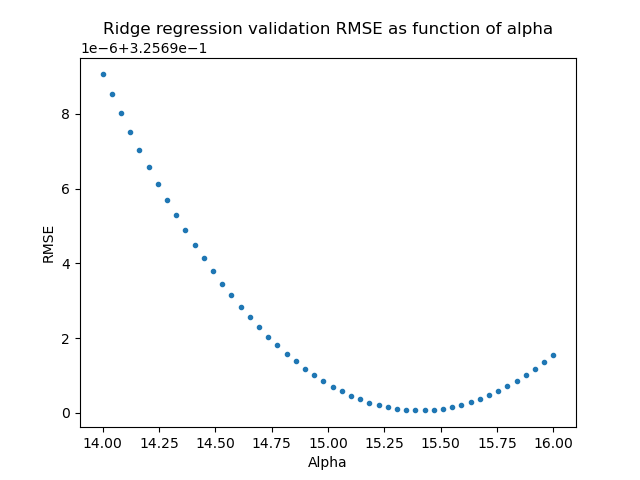

# Miniproject 1

## Introduction

<justify>
In this project I was assigned to create a model that will predict the fuel consumption of a cruise ship base on data from several sensors. Data were provided in CSV files of raw sensor outputs. Units of fuel consumption are left open. 

</justify>

## Data preprocessing
<justify>

Each CSV file contains two columns: time and value. Time is in .NET DateTime.Ticks format and needs to be converted to human readable format in order to properly aggregate the data from all sensors.
</justify>

### Defining the taarget variable
<justify>
To determine the optimal time window to predict the fuel consumption, I aggregated records by day and counted the number of records. That gave me 54 days with records from all sensors. With minimul number of records per day for one sensor was 5894. I chose the window for predicting the consumption to be 1 hour. I will consider the fuel density and fuel volumetri flow to be constant.
</justify>

### Feature extraction 
<justify>
Most of the features will be represented as mean values during the one hour time window. For GPS data it would not make much sense, therefore the GPS data will be represented by minimum and maximum values on set interval. Also the GPS values will need to be converted to  numerice values. The signes will be added acording to the following table.
</justify>

| Direction | Sign |
|-----------|------|
| North     | +    |
| South     | -    |
| East      | +    |
| West      | -    |

Joining the fuel consumption table with data from sensors gives final dataset with 682 data points.

### Prepairing data for training models

<justify>
I decide not to shuffle the data before spliting. Keeping subsets chronological helps to keep validation and testing metrics more relevant towards use on new data. Trainning subset cosints of 477 data points. Validation and testing subset consist of 102 and 103 data points respectively.
</justify>

#### Standardization

<justify>
Since the first model to train will be ridge regression, I will use feature standardization. I experimented with "MinMax" normalisation and standardisation. Each benefiting different model.
</justify>

## Model selection and training
<justify>
I decided to use RMSE as the evaluation metric. The R2 score was also used for it's interpretation benefits.
</justify>

### Ridge regression
<justify>
Ridge regression was chosen as base line model, since linear model is the simpliest one. Ridge regression also utilises the regularization parameter on top of that. The best obtained validation RMSE and R2 were 0.3257 and 0.7459 respectively. This result was obtained using regularisation parameter alpha of 15.3878.
</justify>

### SVM
<justify>
SVM was chosen as the second model for it capabilities of explorign non-linear relations. The best obtained validation RMSE was 0.1261 and validation R2 was 0.9617. This result was obtained using regularisation parameter C of 9.7667.
</justify>

<justify>

This model was the better out of these two. Therefore it was tested on test dataset. The obtained RMSE was 0.1613 and R2 was 0.9080.
</justify>

## Conclusion

<justify>

The best model was SVM regresion model. R2 score of 0.9080 is quite good. Althougth it can be expected that the model performace will drop with newer data. Possible options to further improve model performance are dimensionality reduction and adding distance between starting and ending GPS coordinates in time window. The dimensionality reduction could be done using PCA as the features were not filtered and some of them are correlated for sure (e.g. trackDegreeMagnetic and trackDegreeTrue).

</justify>
